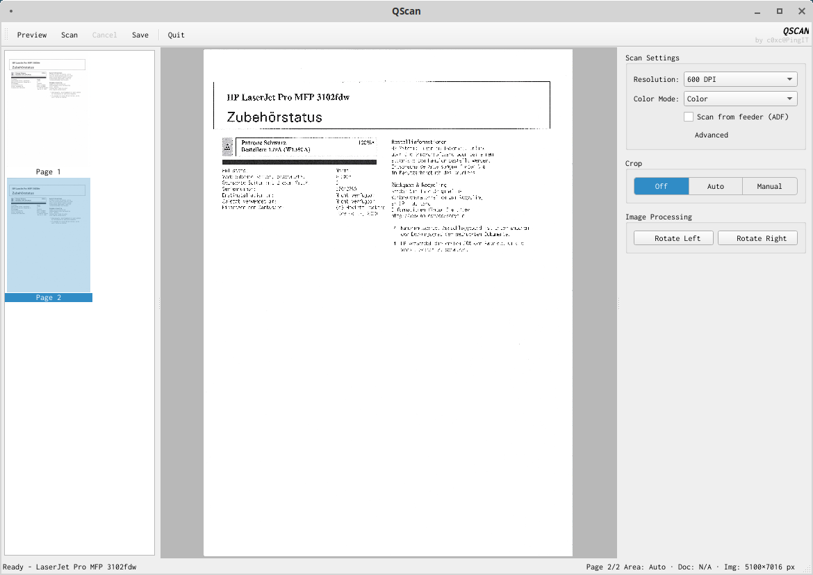

QScan
===

A document scanning application for Linux!
---

### coming soon: scan without scanner (optional service)

- Scanner connected and installed? => Select it and start scanning.
- Network scanner (Airscan). not installed? => Add its hostname or ip and start scanning.
- Scanner is on the other floor but a camera is nearby? => Select it and start scanning. [extra coming soon]

Download
---

Ready-to-use AppImage executable files are available on the [release page](releases/latest).

#### I use Windows

Sorry about that.

Author
------

*from the creator of CapacityTester...*
Philip Seeger (philip@c0xc.net)

License
-------

GPLv3

Please see the file called LICENSE

